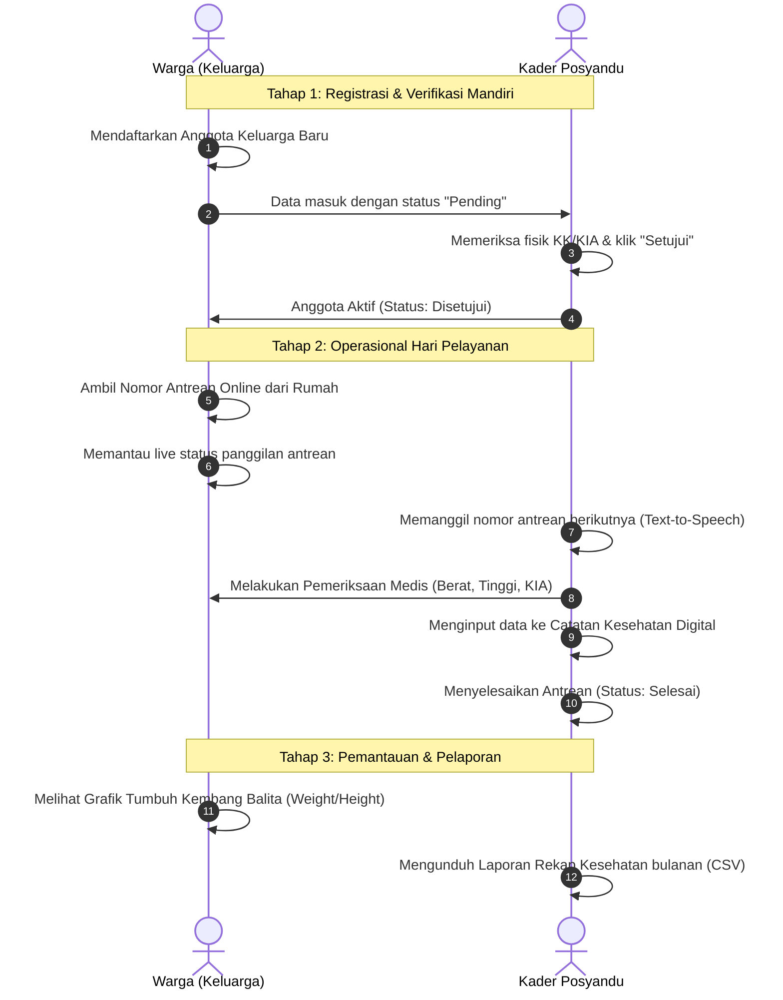

# 🌿 Panduan Presentasi Sistem Informasi Posyandu "DesaSehat"

Dokumen ini disusun untuk membantu Anda melakukan presentasi, demo aplikasi, atau menyusun slide mengenai alur dan fitur sistem informasi DesaSehat.

---

## 1. Pendahuluan & Latar Belakang (Slide 1)
*   **Masalah Lapangan**: Pencatatan data Posyandu secara manual menggunakan buku besar rentan salah ketik, kertas hilang/sobek, antrean panjang saat hari pelayanan, serta sulitnya memantau riwayat kesehatan warga secara historis.
*   **Solusi DesaSehat**: Transformasi Posyandu digital terintegrasi yang memudahkan Warga memantau kesehatan keluarga secara mandiri dan mempercepat pencatatan medis digital oleh Kader secara real-time.

---

## 2. Hak Akses Pengguna / Aktor (Slide 2)
Sistem membagi peran secara jelas untuk membatasi fungsionalitas dan meningkatkan keamanan data:
1.  **Warga (Portal Keluarga)**:
    *   Mendaftarkan anggota keluarga (bayi, lansia, bumil) secara mandiri.
    *   Mengambil nomor antrean pemeriksaan secara online dari rumah.
    *   Melihat visualisasi grafik tumbuh kembang anak (berat, tinggi, lingkar kepala).
    *   Menerima notifikasi publik/personal secara real-time.
2.  **Kader (Command Center)**:
    *   Memverifikasi pendaftaran anggota keluarga baru dari warga.
    *   Mengendalikan jalannya antrean hari pelayanan (Panggil dengan suara otomatis, Lewati, Selesaikan).
    *   Mencatat rekam medis digital (kunjungan & checkup).
    *   Mengelola jadwal kegiatan desa dan menerbitkan pengumuman.
    *   Mengekspor laporan rekap kesehatan Posyandu bulanan (CSV).
    *   Memantau sistem audit log keamanan data.

---

## 3. Alur Kerja Aplikasi (Slide 3: User Flow)

Berikut adalah diagram urutan alur kerja dari pendaftaran hingga pemeriksaan medis selesai:

---

## 4. Skenario Demo Live Aplikasi (Slide 4)

Ikuti langkah-langkah praktis ini saat memperagakan aplikasi di depan audiens:

### Langkah A: Demo Portal Warga (Kemandirian Data)
1.  **Masuk Aplikasi**: Login sebagai Warga menggunakan No. KK (contoh: `1234567890123456`).
2.  **Tambah Anggota Mandiri**: Klik tombol **"Tambah Anggota"** di samping kanan header. Masukkan data bayi baru lahir. Tunjukkan bahwa kartu anggota tersebut muncul dengan badge kuning **"Pending"** dan belum bisa diakses catatan kesehatannya.
3.  **Ambil Antrean**: Klik **"Ambil Antrean"**. Warga akan mendapat tiket antrean (misal `A-1`) beserta perkiraan waktu tunggunya.

### Langkah B: Demo Command Center Kader (Operasional Pelayanan)
1.  **Masuk Aplikasi**: Login sebagai Kader (`username: kader`).
2.  **Verifikasi Berkas**: Tunjukkan widget **"Verifikasi Anggota Baru"** di sebelah kanan dashboard Kader. Klik **"Setujui"** untuk mengaktifkan anggota baru yang diinput Warga tadi.
3.  **Panggilan Suara Otomatis**: Pada antrean pelayanan hari ini, klik **"Panggil"** pada nomor `A-1`. Browser akan mengeluarkan suara panggilan otomatis (*"Antrean Nomor A-1 atas nama Keluarga Bapak..."*).
4.  **Pencatatan Rekam Medis**: Klik **"Catat Pemeriksaan"**, input data berat badan, tinggi badan, jenis imunisasi, dan catatan kesehatan lainnya. Klik simpan, lalu selesaikan antrean.

### Langkah C: Peninjauan Hasil & Pelaporan
1.  **Cek Hasil di Portal Warga**: Buka kembali dashboard Warga. Anggota keluarga yang baru diperiksa sekarang menampilkan grafik pertumbuhan dinamis berdasarkan riwayat pemeriksaan terbarunya.
2.  **Ekspor Laporan Bulanan**: Di portal Kader, buka menu **Laporan**, dan klik **"Ekspor Laporan (CSV)"** sebagai bukti data rekap siap dikirim ke Puskesmas/Dinas Kesehatan.

---

## 5. Fitur Unggulan Tambahan (Slide 5)
*   **Smart Priority Panel**: Fitur cerdas kader untuk menyaring otomatis warga yang terlambat jadwal imunisasi/kontrol rutin (>30 hari) agar dapat dikunjungi langsung secara proaktif.
*   **Keamanan & Audit Log**: Semua tindakan sensitif dicatat bersama nama kader, aktivitas, waktu, dan IP address untuk kepatuhan tata kelola data rekam medis.
*   **Responsive Web Design**: Tampilan yang dioptimalkan menggunakan Tailwind CSS v4, berjalan sangat ringan dan ramah dibuka dari smartphone warga.
